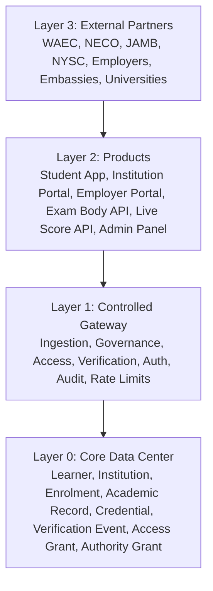

# AcadID Architecture

## System Shape

AcadID is a layered infrastructure platform:

Hard rule:

- Products do not connect directly to the Core Data Center.
- External partners do not connect directly to the Core Data Center.
- Every read/write path passes through the Controlled Gateway.

## Layer 0: Core Data Center

The Core Data Center is the permanent source of truth. It stores the eight core entities and should change only through backward-compatible schema migrations.

Core responsibilities:

- Assign permanent learner UUIDs and AINs.
- Store institutional authority.
- Store enrolment history.
- Store academic records.
- Package approved records into credentials.
- Preserve verification events.
- Preserve access grants.
- Preserve authority grants.

## Layer 1: Controlled Gateway

The gateway is the control plane. It enforces:

- Authentication.
- Authorisation.
- Role scope.
- Student consent.
- Institution authority.
- Rate limits.
- Audit logging.

Gateway doors:

| Door | Purpose | Example Routes |
| --- | --- | --- |
| Ingestion Door | Data intake from institutions and exam bodies | `POST /ingest/students`, `POST /ingest/results`, `POST /ingest/bulk-upload`, `POST /ingest/exam-body` |
| Governance Door | Approval, publishing, amendment, revocation | `POST /govern/submit-batch`, `POST /govern/approve-batch`, `POST /govern/publish`, `POST /govern/amend`, `POST /govern/revoke` |
| Access Door | Student and authorised-party data access | `GET /access/passport`, `POST /access/share-link`, `GET /access/credentials`, `POST /access/revoke-grant` |
| Verification Door | Third-party credential validation | `GET /verify/:token`, `GET /verify/ref/:refnum`, `POST /verify/bulk`, `GET /verify/status/:credId` |

## Layer 2: Products

| Product | Phase | Purpose |
| --- | --- | --- |
| Internal Admin Panel | Phase 0 | Operations control center, institution onboarding, MOU tracking, disputes, audit, compliance, fraud incidents |
| Institution Upload Portal | Phase 1 | First public product for schools to upload student registers and results |
| Student Mobile App | Phase 2 | Learner passport, result timeline, share links, verification log, transfers, disputes |
| Employer Verification Portal | Phase 3 | Revenue engine for employers, universities, embassies, and professional bodies |
| Exam Body Ingest API | Phase 3 | Machine-to-machine integrations with WAEC, NECO, JAMB, NYSC, and similar bodies |
| Live Score Entry API | Phase 4 | Developer/API layer for institutions that want real-time result submission |

## Layer 3: External Partner Ecosystem

External partners are not part of AcadID but integrate through controlled interfaces:

- WAEC API.
- NECO API.
- JAMB CAPS.
- NYSC API.
- Employer portals.
- Foreign universities.
- Embassy systems.
- HR platforms.

Integration methods:

- API calls.
- Webhooks.
- OAuth.
- Controlled bilateral agreements.
- API keys for approved high-volume verification.

## First Practical Build

Build first:

- Core data schema for eight entities.
- UUID and AIN generation.
- Institution onboarding.
- Authority Grant creation from signed MOU.
- Staff roles and authentication.
- Ingestion Door for student register and result uploads.
- Governance Door for three-tier approval.
- Audit logger.
- Internal Admin Panel.
- Institution Upload Portal.

Defer:

- Student native mobile apps until real records exist.
- Employer paid verification until credentials and access grants are stable.
- Exam body APIs until bilateral agreements are real.
- Live Score Entry API and SDKs until the institution upload workflow is proven.

## Roadmap

| Phase | Timing | Build Goal |
| --- | --- | --- |
| Phase 0 | Weeks 1-12 | Data Center and Foundation |
| Phase 1 | Weeks 13-20 | Institution Upload Portal |
| Phase 2 | Weeks 21-32 | Student Mobile App |
| Phase 3 | Months 9-15 | Employer Verification Portal and Exam Body APIs |
| Phase 4 | Year 2+ | Live Score Entry API and Scale |

## CTO Risk Note

The brief is ambitious. The safe engineering strategy is to protect the permanent foundation while keeping early products narrow. The first public proof should be: a founding institution uploads a student register, submits results, gets Registrar approval, publishes signed records, and every action is auditable.
